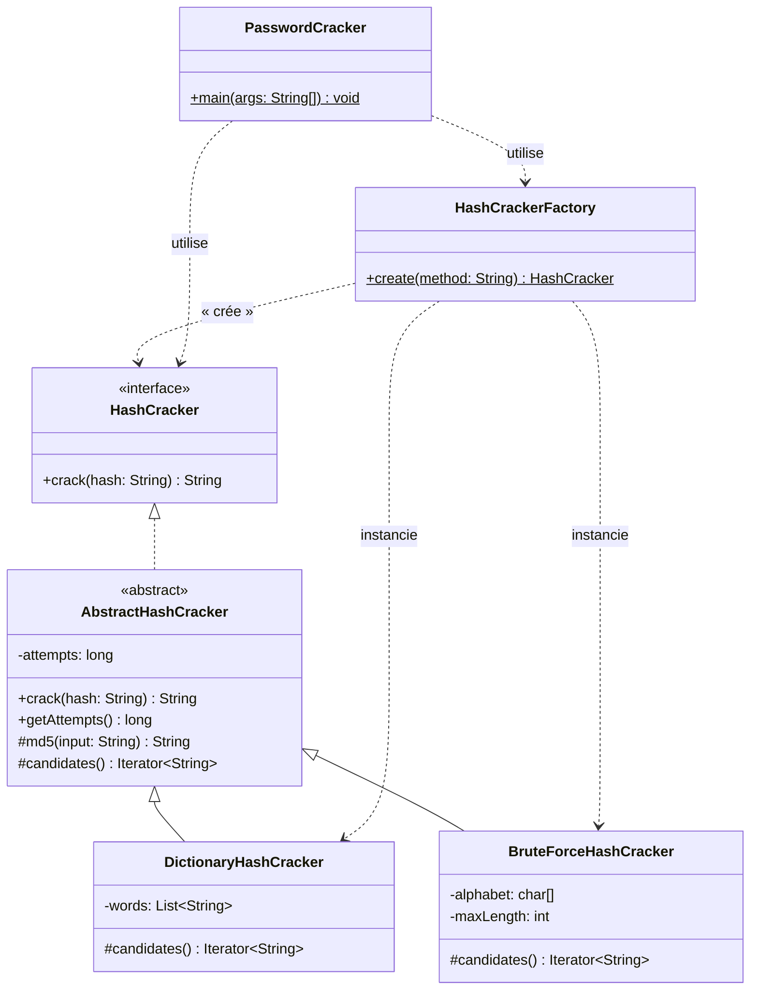

# PasswordCracker v1 — Mise en œuvre du patron *Simple Factory*

Outil en ligne de commande qui retrouve un mot de passe à partir de son empreinte **MD5**, par **dictionnaire** ou par **force brute**. Ce projet illustre le patron de création **Simple Factory**.

> Rapport technique — Mini-Projet 1, module *Patrons de Conception* (L3 GLSI).

---

## 1. Introduction

En cybersécurité, les mots de passe ne sont jamais stockés en clair : ils sont transformés par une fonction de hachage cryptographique (ici MD5). Lors d'un audit, on cherche à évaluer la robustesse d'un mot de passe en tentant de retrouver la valeur d'origine à partir de son empreinte.

`PasswordCracker` est une première version de cet outil. Il met l'accent sur une **architecture orientée objet modulaire** et sur l'utilisation du patron **Simple Factory** pour centraliser la création des stratégies de cassage.

## 2. Présentation du problème

À partir d'un hash MD5 (chaîne hexadécimale de 32 caractères), retrouver le mot de passe correspondant. Deux approches sont demandées :

- **Dictionnaire (`DICO`)** : tester une liste finie de mots probables.
- **Force brute (`BRUTE`)** : générer et tester toutes les combinaisons de l'alphabet `a–z` jusqu'à 4 caractères.

Le programme affiche `Password found: <mot>` ou `Password not found`, ainsi que des informations complémentaires (nombre de tentatives, temps d'exécution).

Contraintes imposées :
- code écrit en **Java** ;
- les classes concrètes ne sont **jamais instanciées directement** dans le programme principal ;
- la création des objets est **centralisée dans une fabrique** ;
- **aucune duplication** de code.

## 3. Architecture

Le projet repose sur du **polymorphisme** derrière une interface commune, une **classe abstraite** qui factorise le code partagé, et une **fabrique** qui centralise la création.

| Élément | Rôle |
|---|---|
| `HashCracker` *(interface)* | Contrat commun : `String crack(String hash)`. Le reste de l'application ne dépend que de cette abstraction. |
| `AbstractHashCracker` *(classe abstraite)* | Factorise le calcul du **MD5**, la **boucle de cassage** (patron *Template Method*) et le **comptage des tentatives**. Élimine la duplication entre les stratégies. |
| `DictionaryHashCracker` | Stratégie concrète : charge un fichier de mots et les fournit comme candidats. |
| `BruteForceHashCracker` | Stratégie concrète : génère paresseusement (*lazy*) toutes les combinaisons `a–z` jusqu'à la longueur max. |
| `HashCrackerFactory` *(fabrique simple)* | Point unique de création : `create("DICO"|"BRUTE")` renvoie un `HashCracker`. |
| `PasswordCracker` *(main)* | Application console : analyse les arguments, appelle la fabrique, mesure et affiche le résultat. |

**Choix de conception clés :**

- Chaque stratégie ne fournit que sa *source de candidats* (`candidates()`) ; l'algorithme de comparaison hash/mot est unique et vit dans `AbstractHashCracker`. → **zéro duplication**.
- La génération force brute est un **itérateur « compteur » (odometer)** : les combinaisons sont produites une à une, sans jamais toutes les stocker en mémoire.
- `PasswordCracker` (le `main`) **ne référence aucune classe concrète** : il ne connaît que `HashCrackerFactory` et `HashCracker`.

## 4. Diagramme UML



> L'énoncé n'impose que `HashCracker`, les deux stratégies et la fabrique. `AbstractHashCracker` est un ajout légitime pour respecter la contrainte **« éviter les duplications »**.

## 5. Usage du patron *Simple Factory*

Le patron **Simple Factory** encapsule la logique de création dans une classe dédiée. Le client demande un produit par un identifiant (`"DICO"`, `"BRUTE"`) sans connaître la classe concrète instanciée.

```java
// Côté application (main) : aucune classe concrète n'apparaît
HashCracker cracker = HashCrackerFactory.create(method);
String password = cracker.crack(hash);
```

```java
// La fabrique : unique point de décision
public static HashCracker create(String method) {
    switch (method.trim().toUpperCase()) {
        case "DICO":  return new DictionaryHashCracker();
        case "BRUTE": return new BruteForceHashCracker();
        default:      throw new IllegalArgumentException("Méthode inconnue : " + method);
    }
}
```

**Bénéfices ici :** le `main` dépend uniquement d'abstractions (`HashCracker`, `HashCrackerFactory`) ; le choix de la stratégie est décidé à un seul endroit ; ajouter une méthode ne touche pas au code client.

## 6. Résultats obtenus

Compilation puis exécution (voir §*Compilation & exécution* plus bas).

**Dictionnaire — mot présent (`secret`)**
```
$ java -cp bin com.passwordcracker.PasswordCracker -m DICO -h 5ebe2294ecd0e0f08eab7690d2a6ee69
Password found: secret
Tentatives : 2
Temps d'execution : 12 ms
```

**Force brute — `test`**
```
$ java -cp bin com.passwordcracker.PasswordCracker -m BRUTE -h 098f6bcd4621d373cade4e832627b4f6
Password found: test
Tentatives : 355414
Temps d'execution : 299 ms
```

**Force brute — `zzz`**
```
$ java -cp bin com.passwordcracker.PasswordCracker -m BRUTE -h f3abb86bd34cf4d52698f14c0da1dc60
Password found: zzz
Tentatives : 18278
Temps d'execution : 81 ms
```

**Aucune correspondance**
```
$ java -cp bin com.passwordcracker.PasswordCracker -m DICO -h 00000000000000000000000000000000
Password not found
```

> ⚠️ **Note importante sur le hash de l'énoncé.** L'énoncé donne l'exemple `e7247759c1633c0f9f1485f3690294a9` pour le mot `test`. Vérification faite, ce hash **ne correspond pas** à `md5("test")`, qui vaut en réalité `098f6bcd4621d373cade4e832627b4f6`. La force brute complète (`a–z`, longueur ≤ 4, 475 254 combinaisons) ne trouve d'ailleurs aucun antécédent pour le hash de l'énoncé : ce n'est ni un mot de 4 lettres minuscules, ni un mot du dictionnaire. Les exemples ci-dessus utilisent donc des hashes MD5 réels.

**Vidéo de présentation (≤ 10 min) :** _à insérer ici (lien)._

## 7. Difficultés rencontrées

- **Force brute et mémoire :** générer puis stocker les ~475 000 combinaisons serait coûteux. Résolu par un **itérateur paresseux** produisant chaque candidat à la demande.
- **Éviter la duplication :** dictionnaire et force brute partagent la même logique (hacher, comparer). Résolu en remontant cet algorithme dans `AbstractHashCracker` (*Template Method*), chaque stratégie ne fournissant que ses candidats.
- **Robustesse de la fabrique :** gestion des méthodes inconnues / valeurs nulles via `IllegalArgumentException`, et normalisation de la casse (`DICO`/`dico`).
- **Hash erroné de l'énoncé :** identifié en testant, documenté au §6 avec les vrais hashes MD5.

## 8. Conclusion

Le patron **Simple Factory** offre une séparation nette entre l'utilisation d'un objet et sa création : le programme principal reste découplé des stratégies concrètes, et la sélection se fait en un point unique. Combiné au polymorphisme et à une classe abstraite qui mutualise le code commun, il aboutit à une architecture **modulaire, lisible et sans duplication**.

Sa limite est connue : ajouter une stratégie oblige à modifier la fabrique — ce qui viole le principe **Open/Closed**. C'est précisément ce point que le mini-projet suivant corrigera (Factory Method / stratégie enregistrable).

---

## Questions de réflexion

1. **Quels avantages apporte la fabrique simple ?**
   Elle centralise la création en un seul endroit, découple le code client des classes concrètes (le `main` ne dépend que d'abstractions), simplifie la maintenance et évite la duplication du code d'instanciation. Le choix de la stratégie se fait via un simple identifiant textuel.

2. **Quels sont ses inconvénients ?**
   La fabrique doit être **modifiée à chaque ajout** de stratégie (elle viole le principe Open/Closed). Le `switch` central devient un point de couplage qui grossit avec le nombre de produits, et la sélection par chaîne de caractères n'est pas vérifiée à la compilation.

3. **Que faut-il modifier lorsqu'une nouvelle stratégie est ajoutée ?**
   Deux choses : (a) créer la nouvelle classe concrète (ex. `RainbowTableHashCracker extends AbstractHashCracker`) et (b) **ajouter un `case`** correspondant dans `HashCrackerFactory.create(...)`. Le code client (`main`) reste, lui, inchangé.

4. **La fabrique respecte-t-elle le principe Open/Closed ?**
   **Non.** Le principe Open/Closed demande qu'une classe soit *ouverte à l'extension mais fermée à la modification*. Or, ajouter une stratégie impose de **modifier** le `switch` de la fabrique. C'est la limitation majeure du Simple Factory, levée par des patrons plus évolués (Factory Method, Abstract Factory, ou enregistrement dynamique des stratégies).

---

## Compilation & exécution

**Prérequis :** un JDK (Java 8 ou supérieur).

**Compiler :**
```bash
mkdir -p bin
javac -d bin src/com/passwordcracker/*.java
```
(ou `bash build.sh`)

**Exécuter :**
```bash
java -cp bin com.passwordcracker.PasswordCracker -m DICO  -h 5ebe2294ecd0e0f08eab7690d2a6ee69
java -cp bin com.passwordcracker.PasswordCracker -m BRUTE -h 098f6bcd4621d373cade4e832627b4f6
```

## Structure du projet

```
PasswordCracker/
├── src/com/passwordcracker/
│   ├── HashCracker.java            # Interface commune
│   ├── AbstractHashCracker.java    # Code partagé (MD5, boucle, compteur)
│   ├── DictionaryHashCracker.java  # Stratégie dictionnaire
│   ├── BruteForceHashCracker.java  # Stratégie force brute
│   ├── HashCrackerFactory.java     # Fabrique simple
│   └── PasswordCracker.java        # Application console (main)
├── dictionary.txt                  # Liste de mots (un par ligne)
├── build.sh                        # Script de compilation
└── README.md                       # Ce rapport
```
